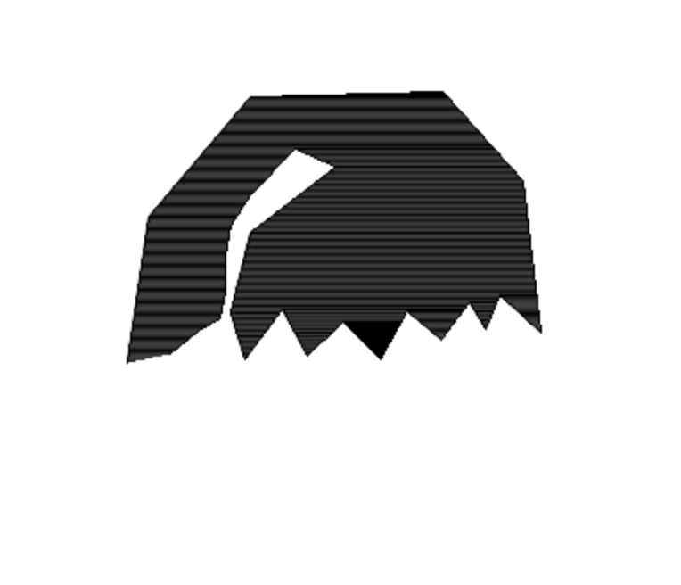

# Лабораторные работы по курсу "Компьютерная графика"

1. Алгоритм Брезенхема для построения отрезка.
   (Для компиляции необходимо добавить библиотеку SFML)  
   <code>
   brew install libsfml-dev (MacOS)
   </code>
   <code>  
   sudo apt-get install libsfml-dev (Linux)
   </code>  
   Результат работы программы:
   
2. Алгоритм Цируса-Бека для построения отрезка.
   (Сборка аналогична сборке первой лабораторной работы)
   Результат работы программы:
   
3. Фильтр (оператор) Собеля.  
   Для сборки необходима библиотека PIL.
   Ее можно поставить следующей командой  
   <code>
   brew install libtiff libjpeg webp littlecms / pip install Pillow
   </code>  
   Результат работы программы
   
     
   
4. Кривая Безье второго порядка
   Для сборки необходима библиотека pygame.
   Ее можно поставить следующей командой  
   <code>
   pip install pygame
   </code>  
   Результат работы программы
     
   
5. Заливка многоугольника
   Для сборки необходима библиотека openCV.
   Ее можно поставить следующей командой  
   <code>
   brew install opencv
   </code>  
   Результат работы программы  
   
   
6. Поворот кривой Безье матрицей повотора
   Для сборки необходима библиотека openCV.
   Ее можно поставить следующей командой  
   <code>
   brew install opencv
   </code>  
   Результат работы программы  
     
   
   
   